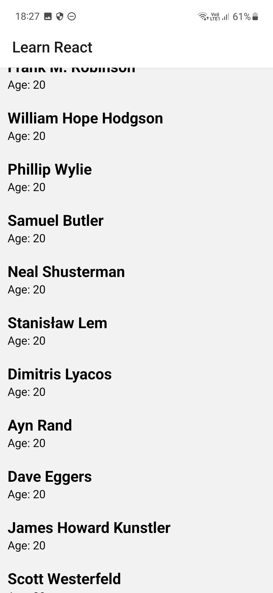

# ⚛️ Learn React Native

This repository is dedicated to tracking my progress and learning journey in mastering React Native, a popular JavaScript framework for building mobile applications. 

## Resources

* [The Complete React Native + Hooks Course by Stephen Grider](https://www.udemy.com/course/the-complete-react-native-and-redux-course)  

## Screenshots

I will add new screenshots as I create new practice apps.

 