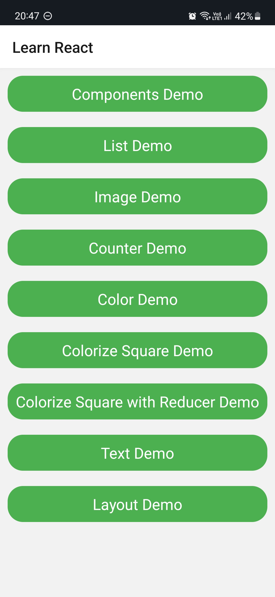

# ⚛️ Learn React Native

This repository is dedicated to tracking my progress and learning journey in mastering React Native, a popular JavaScript framework for building mobile applications. 

## Resources

* [The Complete React Native + Hooks Course by Stephen Grider](https://www.udemy.com/course/the-complete-react-native-and-redux-course)  

## Screenshots

I will add new screenshots as I create new practice apps.

<table>
<thead>
  <tr>
    <th>Home Screen</th>
    <th>List Screen</th>
    <th>Image Screen</th>
    <th>Counter Screen</th>
  </tr>
</thead>
<tbody>
  <tr>
    <td></td>
    <td>
    
    
    </td>
    <td>
    
    
    </td>
    <td>
    
    
    </td>
  </tr>
</tbody>
<thead>
  <tr>
    <th>Color Generator</th>
    <th>Colorize Square</th>
    <th>Text Screen</th>
    <th>-</th>
  </tr>
</thead>
<tbody>
  <tr>
    <td>
    
    
    </td>
    <td>
    
    
    </td>
    <td>
    
    
    </td>
    <td>-</td>
  </tr>
</tbody>
</table>
